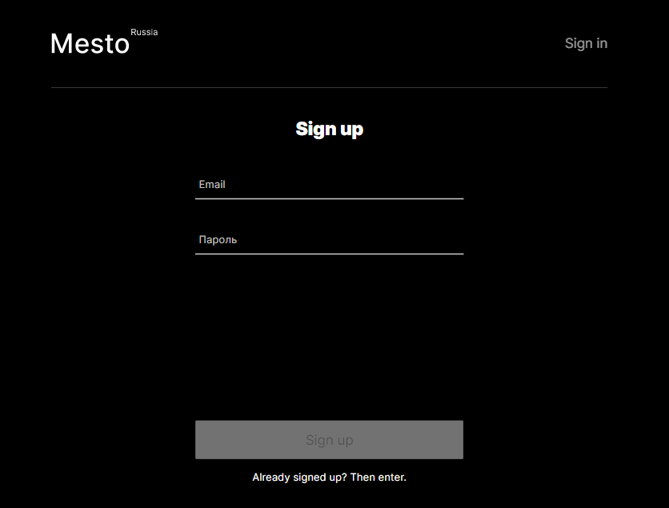
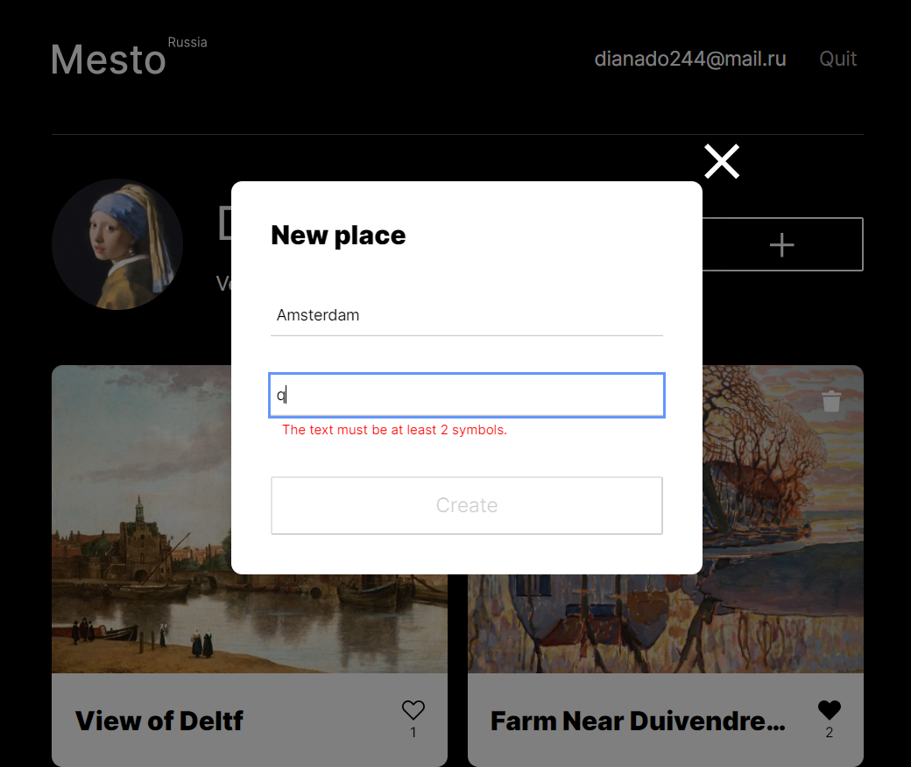
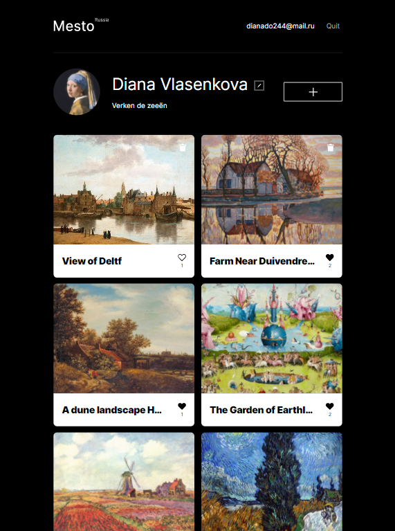

# :large_blue_diamond: A study project Mesto at Practicum by Yandex

A single-page application that simulates a user's page with a gallery.

:small_blue_diamond: **App functions:** :small_blue_diamond:

-   editing a profile info and avatar
-   adding images to the gallery via url-links
-   deleting images
-   putting likes
-   popups
-   form validation.

---

## :mag_right: Preview




---

**GitPages link**

[GitPages](https://dianadomino24.github.io/mesto/index.html)

---

## :rocket: Technologies

-   **JavaScript ES6** - object-oriented programming(**OOP**), fetch API(GET, PUT, DELETE, PATCH, POST methods) form validation,

-   **Asynchronous functions and Promises**,

-   semantic **HTML5**, styles - **CSS3** including Flexbox, Grid, adaptive layout,

-   **BEM** methodology,

-   **Webpack**,

-   **Babel**,

-   **Figma**, **Pixel perfect**,

-   **Git** versions, branches.

---

## :arrow_down: How to install and test

1. Clone the repository:

```
git clone https://github.com/dianadomino24/mesto.git
```

2. Install dependencies:

```
npm install
```

3. Development mode:

```
      npm run dev
```

---

**Figma Layouts**

-   [Figma 4](https://www.figma.com/file/StZjf8HnoeLdiXS7dYrLAh/JavaScript.-Sprint-4)

-   [Figma 5](https://www.figma.com/file/nlYpT4VhFiwimn2YlncrcF/JavaScript.-Sprint-5?node-id=0%3A1)

-   [6](https://www.figma.com/file/XNaGNEZD5NEjeyJzAT4gMb/JavaScript.-Sprint-6?node-id=0%3A1)

-   [9](https://www.figma.com/file/hhhIavVTeuilfPPZ6sbifl/JavaScript.-Sprint-9?node-id=0%3A1)

**Practicum by Yandex** - https://practicum.yandex.com/

---

## :sparkles: Thanks for watching! :sparkles:



<!-- **В перспективе**

В перспективе необходимо доработать сайт:

-   реализовать проверку валидности, используя регулярные выражения
-   реализовать редактирование текущих карточек
-   перетаскивание карточек мышью
-   копирование карточек. -->
<!--
**Технологии**

Освоены:

-   настройка взаимодействия с сервером (GET, PUT, DELETE, PATCH, POST методы),
-   использование асинхронных ф-ций и промисов,
-   рефакторинг кода с использованием классов из ООП,
    деструктуризация и слабое связывание классов,
-   сборка проекта с помощью Webpack(минификация, транспиляция, автопрефиксер),
-   методы валидации форм, вывод стандартных браузерных текстов ошибок в кастомных стилях,
    измерение состояния кнопки submit в зависимости от валидности формы,
-   методы работы с формами в javascript, изменение классов,
    условные конструкции, метод addEventListener,
-   методы добавления разметки через template.content.cloneNode,
-   использование модулей
-   применение свойств target у event,
-   метод forEach,
-   отзывчивая (responsive), адаптивная (adaptive) и
    резиновая (liquid/fluid) верстки,
-   flex- и grid- верстка,
-   Nested файловая структура по БЭМ. -->
